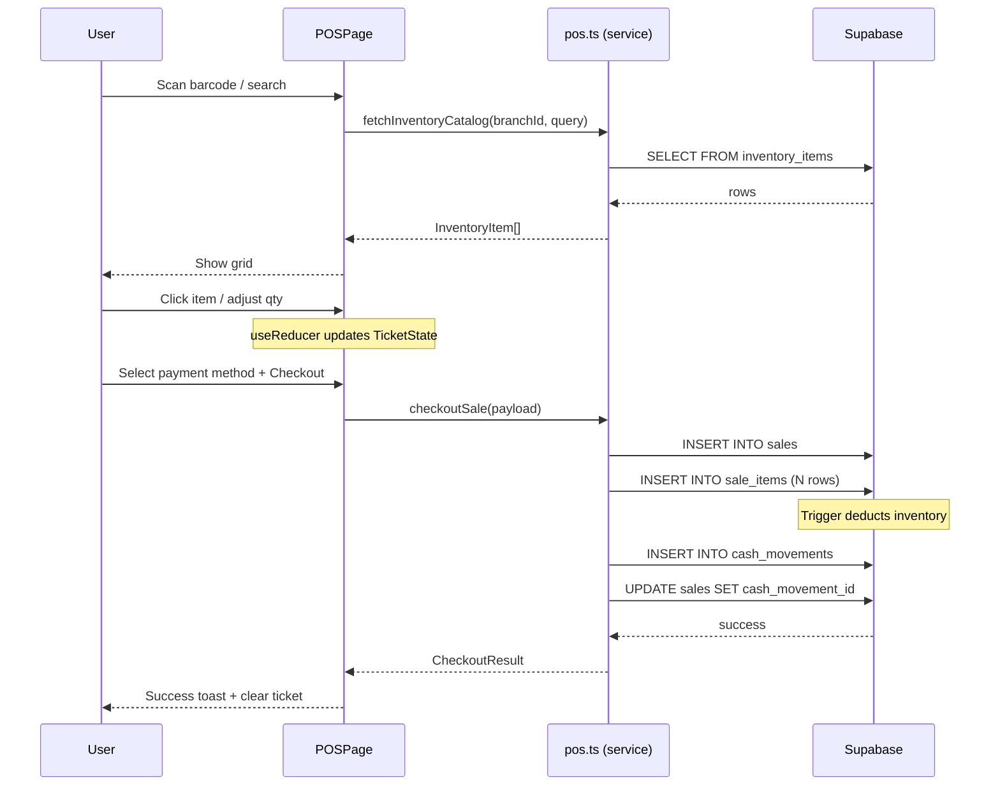
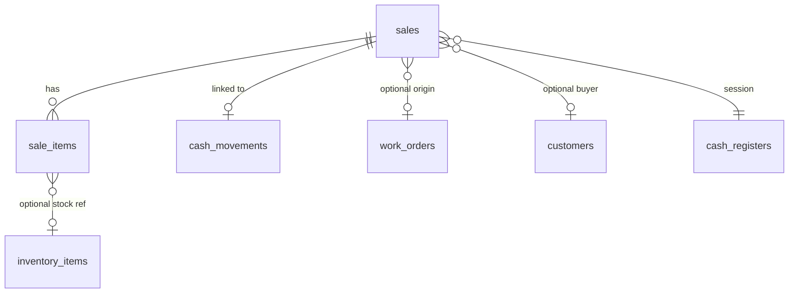

# Design: POS Sales Panel

## Context

See [proposal.md](./proposal.md) for the full intent and scope.  
This design materialises the POS Sales Panel feature: a split-screen checkout interface, new `sales` / `sale_items` tables, automatic `cash_movements` linkage on checkout, and two fast-action workflows (Deliver Order, Register Expense).

---

## Goals / Non-Goals

### Goals
1. Introduce a dedicated `/pos` route with a split-screen UI (catalog left, ticket right) optimised for speed-of-sale and barcode-scanner input.
2. Create `sales` and `sale_items` tables to store completed sale transactions with line-item detail.
3. Atomically link every sale checkout to a `cash_movements` income record and (optionally) deduct inventory.
4. Provide fast actions: "Entregar Orden" (pull pending balance from a work order) and "Registrar Gasto" (quick expense modal).
5. Keep all service-layer logic UI-agnostic per [ARCHITECTURE.md](../../ARCHITECTURE.md) so it can be reused by the future mobile app.

### Non-Goals
- Multi-register / till session management (beyond using the existing open `cash_registers` row).
- Advanced inventory CRUD (handled by the Inventory module).
- Barcode hardware driver integration (the search bar is *scanner-ready* by accepting pasted/scanned text, not by implementing a driver).
- Reporting or sales analytics dashboards.

---

## Decisions

### Decision 1 — New `sales` and `sale_items` tables

**Choice:** Two new tables following the existing schema conventions (UUID PKs, `branch_id` FK, RLS, timestamps).

```sql
-- New enum for sale status
CREATE TYPE public.sale_status AS ENUM ('completed', 'voided');

CREATE TABLE public.sales (
    id             UUID PRIMARY KEY DEFAULT gen_random_uuid(),
    branch_id      UUID NOT NULL REFERENCES public.branches(id) ON DELETE CASCADE,
    cash_register_id UUID REFERENCES public.cash_registers(id) ON DELETE SET NULL,
    cash_movement_id UUID REFERENCES public.cash_movements(id) ON DELETE SET NULL,
    work_order_id  UUID REFERENCES public.work_orders(id) ON DELETE SET NULL,
    payment_method public.payment_method NOT NULL DEFAULT 'cash',
    subtotal       NUMERIC(12,2) NOT NULL DEFAULT 0 CHECK (subtotal >= 0),
    discount_type  public.discount_type NOT NULL DEFAULT 'none',
    discount_value NUMERIC(12,2) NOT NULL DEFAULT 0,
    total          NUMERIC(12,2) NOT NULL DEFAULT 0 CHECK (total >= 0),
    status         public.sale_status NOT NULL DEFAULT 'completed',
    customer_id    UUID REFERENCES public.customers(id) ON DELETE SET NULL,
    -- Fiscal / ARCA readiness fields
    customer_doc_type   VARCHAR(20) DEFAULT '99', -- DNI (96), CUIT (80), Consumidor Final (99)
    customer_doc_number VARCHAR(50),
    invoice_type        VARCHAR(10),              -- FA_A, FA_B, FA_C, TKT (null = not invoiced)
    invoice_number      VARCHAR(50),              -- e.g. 0001-00001234
    cae                 VARCHAR(50),              -- CAE provided by ARCA/AFIP
    cae_expires_at      DATE,
    afip_qr_data        TEXT,                     -- Base64 encoded payload for fiscal QR reprint
    created_by     UUID REFERENCES public.profiles(id) ON DELETE SET NULL,
    created_at     TIMESTAMPTZ NOT NULL DEFAULT NOW()
);

CREATE TABLE public.sale_items (
    id              UUID PRIMARY KEY DEFAULT gen_random_uuid(),
    sale_id         UUID NOT NULL REFERENCES public.sales(id) ON DELETE CASCADE,
    inventory_item_id UUID REFERENCES public.inventory_items(id) ON DELETE SET NULL,
    description     VARCHAR(255) NOT NULL,
    quantity        NUMERIC(10,2) NOT NULL DEFAULT 1 CHECK (quantity > 0),
    unit_price      NUMERIC(12,2) NOT NULL DEFAULT 0,
    tax_rate        NUMERIC(5,2) NOT NULL DEFAULT 21.00, -- Alícuota IVA (21.00%, 10.50%, 0.00%)
    total_price     NUMERIC(12,2) GENERATED ALWAYS AS (quantity * unit_price) STORED,
    created_at      TIMESTAMPTZ NOT NULL DEFAULT NOW()
);
```

**Rationale:**
- `sales.cash_movement_id` links 1:1 to the income record created at checkout, enabling FinancePage to trace back to sale details.
- `sales.work_order_id` is nullable — populated only when the sale originated from the "Deliver Order" fast action. When populated, customer doc info (`customer_doc_type`, `customer_doc_number`) is automatically mapped from `customers.tax_id`.
- `sales.cae`, `sales.cae_expires_at`, and `sales.afip_qr_data` ensure the POS is 100% prepared for future ARCA electronic invoicing (WSFE) and local receipt re-printing without calling ARCA multiple times.
- `sale_items.tax_rate` prepares line items for net tax calculations during fiscal invoice generation.
- `sale_items.inventory_item_id` is nullable to support "Manual Sale" line items that don't reference inventory.
- `total_price` is a `GENERATED ALWAYS` column mirroring the pattern already used in `work_order_items`.

**Alternatives considered:**
- *Reuse `cash_movements` + description field*: Rejected because it loses line-item granularity and prevents future reporting on product-level sales.
- *Single `sales` table with JSON items*: Rejected because it defeats relational querying, indexing, and stock trigger integration.

### Decision 2 — Stock deduction trigger on `sale_items`

**Choice:** Create a trigger `trg_deduct_stock_on_sale_item` on `sale_items` that mirrors the behaviour of the existing `trg_freeze_item_cost_and_update_stock` on `work_order_items`.

```sql
CREATE OR REPLACE FUNCTION public.fn_deduct_stock_on_sale_item()
RETURNS TRIGGER AS $$ ...
```

On INSERT: if `inventory_item_id IS NOT NULL`, deduct `quantity` from `inventory_items.quantity`.  
On DELETE (void): restore quantity back.

**Rationale:** Re-using the proven trigger pattern from `work_order_items` ensures stock consistency. The trigger fires *after* the row is inserted, so a checkout that inserts N sale_items will atomically adjust stock.

**Alternative considered:** Client-side stock deduction in the service layer — rejected due to race conditions and non-atomicity.

### Decision 3 — Checkout as an atomic service function (not an RPC)

**Choice:** Implement `checkoutSale()` in the service layer as a multi-step Supabase client call (insert `sales` → insert `sale_items[]` → insert `cash_movements` → update `sales.cash_movement_id`).

**Rationale:**
- The existing codebase performs multi-step mutations from the service layer (see `deliverOrder` in `work-order-details.ts` which does 4 sequential operations).
- Triggers handle the critical atomicity concerns (stock deduction, cash register validation).
- Avoids introducing a new RPC just for this flow, keeping the migration surface small.

**Trade-off:** If the final `UPDATE sales SET cash_movement_id` fails after the cash movement was created, the sale will exist without the back-link. This is acceptable because the `cash_movements` row itself carries `description` referencing the sale, and a future cleanup query can reconcile.

**Alternative considered:** A PostgreSQL RPC `create_sale_with_items(...)` — deferred to a future iteration if the multi-step approach proves fragile in production.

### Decision 4 — Split-screen component architecture

**Choice:** `POSPage.tsx` acts as the orchestrator holding all state. Two child regions rendered side-by-side:

```
┌──────────────────────────────────────────────────┐
│                   POSPage.tsx                    │
│  ┌─────────────────────┬────────────────────────┐│
│  │   CatalogPanel      │     TicketPanel        ││
│  │  ┌───────────────┐  │  ┌──────────────────┐  ││
│  │  │ SearchBar     │  │  │ TicketItemList   │  ││
│  │  │ (barcode)     │  │  │ (qty +/-)        │  ││
│  │  ├───────────────┤  │  ├──────────────────┤  ││
│  │  │ ItemGrid      │  │  │ SubtotalBar      │  ││
│  │  │ (inventory)   │  │  │ PaymentSelector  │  ││
│  │  ├───────────────┤  │  │ CheckoutButton   │  ││
│  │  │ ManualSaleBtn │  │  └──────────────────┘  ││
│  │  └───────────────┘  │                        ││
│  │                     │  ┌──────────────────┐  ││
│  │  ┌───────────────┐  │  │ FastActions      │  ││
│  │  │ FastActionBar │  │  │ DeliverOrderModal│  ││
│  │  │ [Entregar]    │  │  │ ExpenseModal     │  ││
│  │  │ [Gasto]       │  │  └──────────────────┘  ││
│  │  └───────────────┘  │                        ││
│  └─────────────────────┴────────────────────────┘│
└──────────────────────────────────────────────────┘
```

**State management:** `useReducer` in `POSPage.tsx` with a `TicketState`:
```ts
type TicketItem = {
  tempId: string;            // client-side key
  inventoryItemId?: string;  // null for manual items
  description: string;
  quantity: number;
  unitPrice: number;
};

type TicketState = {
  items: TicketItem[];
  paymentMethod: 'cash' | 'qr' | 'card';
  workOrderId?: string;      // set by "Deliver Order" action
};
```

**Rationale:**
- Keeps state co-located in the page, avoiding prop-drilling beyond one level.
- `useReducer` is appropriate because ticket mutations (add item, change qty, remove, clear) have well-defined action shapes.
- Modals (`DeliverOrderModal`, `ExpenseModal`, `ManualSaleModal`) are lazy-rendered and controlled via boolean flags.

**Responsive behaviour:** On mobile viewports (`< md`), the two panels stack vertically (catalog on top, ticket below with a sticky checkout bar).

### Decision 5 — Fast Action: Deliver Order

**Choice:** The "Entregar Orden" button opens `DeliverOrderModal` which:
1. Presents a search-by-order-number input.
2. Calls a new service function `searchOrderByNumber(branchId, orderNumber)` that returns `{ id, order_number, balance, status, customer_name }`.
3. On confirm, adds a single `TicketItem` with `description = "Saldo Orden #ORD-XXX"`, `unitPrice = balance`, `quantity = 1`, and sets `ticketState.workOrderId`.
4. On checkout, the sale is linked to the work order via `sales.work_order_id`, the cash movement uses `category = 'work_order_payment'`, and `deliverOrder()` from `work-order-details.ts` is called to transition the order status to `delivered`.

**Rationale:** Reuses the existing `deliverOrder` function (which handles status transition, notes, and financial recalculation) instead of duplicating logic.

### Decision 6 — Fast Action: Register Expense

**Choice:** The "Registrar Gasto" button opens `ExpenseModal` which inserts directly into `cash_movements` with `type = 'expense'` and `category = 'manual_expense'`. This does **not** create a `sales` record — it is a pure cash movement.

**Rationale:** An expense is not a sale. Mixing it into the `sales` table would pollute the data model. The existing `cash_movements` table already supports this flow with the `manual_expense` category.

### Decision 7 — No new `cash_category` enum value needed

**Choice:** Reuse existing `stock_sale` enum value for POS product sales. Use `work_order_payment` for deliver-order checkouts. Use `manual_expense` for quick expenses.

**Rationale:** The `cash_category` enum already contains `stock_sale` which semantically matches "direct sale of stock item from POS". No schema migration needed for this enum.

### Decision 8 — New service file `pos.ts` (UI-agnostic)

**Choice:** Create a dedicated `apps/web/src/lib/services/pos.ts` containing:
- Types: `Sale`, `SaleItem`, `TicketItem`, `CheckoutPayload`, `CheckoutResult`
- `fetchInventoryCatalog(supabase, branchId, search?)` — paginated inventory query
- `searchOrderByNumber(supabase, branchId, orderNumber)` — for deliver-order lookup
- `checkoutSale(supabase, payload: CheckoutPayload)` — atomic checkout
- `addQuickExpense(supabase, branchId, amount, method, description)` — expense fast action

**Rationale:** Per ARCHITECTURE.md, services must be UI-agnostic. A separate file avoids bloating `work-order-details.ts` with unrelated POS logic and makes the future `packages/core` extraction clean.

### Decision 9 — Sidebar navigation entry

**Choice:** Add a "Ventas" (Sales / POS) entry to the `DashboardLayout.tsx` sidebar, using the `ShoppingCart` icon from lucide-react, positioned between "Inventario" and "Caja y Finanzas".

---

## File Changes

| File | Action | Description |
|------|--------|-------------|
| `supabase_schema.sql` | **Modified** | Add `sale_status` enum, `sales` table, `sale_items` table, stock deduction trigger, RLS policies, and performance indexes. |
| `apps/web/src/lib/services/pos.ts` | **New** | UI-agnostic service layer: types, `fetchInventoryCatalog`, `searchOrderByNumber`, `checkoutSale`, `addQuickExpense`. |
| `apps/web/src/pages/POSPage.tsx` | **New** | Main POS page component — orchestrates state via `useReducer`, renders `CatalogPanel` and `TicketPanel`. |
| `apps/web/src/components/pos/CatalogPanel.tsx` | **New** | Left-side panel: search bar, inventory item grid, "Manual Sale" button, fast action bar. |
| `apps/web/src/components/pos/TicketPanel.tsx` | **New** | Right-side panel: ticket item list with qty controls, subtotal, payment method selector, checkout button. |
| `apps/web/src/components/pos/TicketItemRow.tsx` | **New** | Single row in the ticket list — item name, qty +/- buttons, line total, remove button. |
| `apps/web/src/components/pos/PaymentMethodSelector.tsx` | **New** | Radio/button group for Cash / QR / Card selection. |
| `apps/web/src/components/pos/DeliverOrderModal.tsx` | **New** | Modal: search order by number, display pending balance, confirm to add to ticket. |
| `apps/web/src/components/pos/ExpenseModal.tsx` | **New** | Modal: amount input, description, payment method, submit to create `cash_movements` expense. |
| `apps/web/src/components/pos/ManualSaleModal.tsx` | **New** | Modal: description + price input for items not in inventory catalog. |
| `apps/web/src/App.tsx` | **Modified** | Add `<Route path="/pos" element={<POSPage />} />` inside the protected `DashboardLayout` group. |
| `apps/web/src/components/DashboardLayout.tsx` | **Modified** | Add "Ventas" sidebar nav item with `ShoppingCart` icon linking to `/pos`. |

---

## Component Data Flow



---

## Database Entity Relationships



---

## Risks / Trade-offs

| Risk | Severity | Mitigation |
|------|----------|------------|
| **Non-atomic checkout** — multi-step service calls without a DB transaction could leave partial state if a middle step fails. | Medium | Triggers handle the critical side-effects (stock deduction). The service inserts `sales` first, so if `cash_movements` insertion fails, the sale exists but without payment linkage — detectable and recoverable. Escalation path: migrate to a PostgreSQL RPC if this proves problematic. |
| **Concurrent stock deduction** — two POS sessions selling the last unit simultaneously. | Low | The `inventory_items.quantity` has a `CHECK (quantity >= 0)` constraint. The second transaction will fail at the DB level, and the service will surface the error. Acceptable for a single-branch workshop scale. |
| **Enum migration** — adding `sale_status` enum requires a DB migration. | Low | Standard `CREATE TYPE` DDL, no existing data affected. Can be applied via Supabase migration file. |
| **Ticket state loss** — if the user navigates away or refreshes, the in-progress ticket is lost. | Low | Acceptable for MVP. Future improvement: persist ticket to `sessionStorage`. |
| **Performance on large catalogs** — fetching all inventory items at once may slow down for shops with 1000+ items. | Low | `fetchInventoryCatalog` uses server-side `ilike` search and pagination (limit 50). The grid only renders visible items. |
